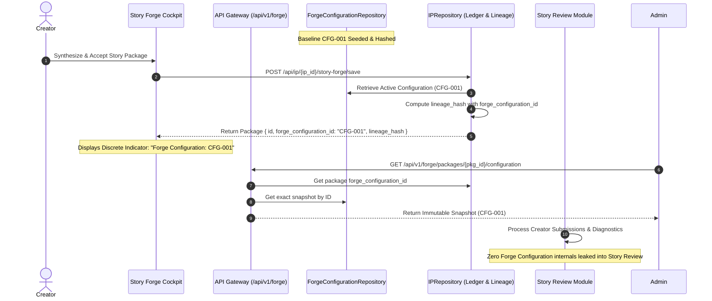

# Welele Media™ — Forge Configuration Registry v1
**Foundational Provenance Layer & Immutable Execution Environment Snapshot Specification**  
**Version:** 1.0.0-canonical  
**Date:** September 2026  
**Status:** Certified & Production-Ready  

---

## 1. Executive Summary & Architectural Overview

The **Forge Configuration Registry v1** provides an authoritative, immutable provenance foundation for all story generation and narrative reasoning executed within Welele Media™.

In modern production environments, AI reasoning models, prompt templates, dramatic rules, and evaluation rubrics evolve over time. To ensure that every Story Package generated across the platform is **cryptographically traceable, historically auditable, and 100% reproducible**, the Registry captures and freezes the exact Forge execution state into an immutable snapshot identifier (`forge_configuration_id`, e.g., `CFG-001`).

### Core Architectural Invariants:
1. **Strict Immutability:** Once a configuration snapshot is registered with an identifier (e.g. `CFG-001`), it is never mutated. Any alteration to engine versions, constitution rules, skill versions, or evaluation rubrics produces a distinct configuration record (e.g. `CFG-002`).
2. **Deterministic Cryptographic Hashing:** Every snapshot derives a deterministic SHA-256 `config_hash` calculated across the canonicalized JSON representation of its engine and skill components. Idempotent registration requests return the existing immutable ID without duplicate side-effects.
3. **Lineage Attachment:** Every Story Package persisted via `/api/ip/{ip_id}/story-forge/save` automatically binds the active or specified `forge_configuration_id`. This ID is incorporated into the package's cryptographic `lineage_hash`.
4. **Boundary Isolation & Discrete Indicator:** The normal creator-facing experience displays only a discrete indicator (`Forge Configuration: CFG-001`). Detailed configuration internals remain invisible to creators and are strictly isolated from Story Review diagnostics.
5. **On-Demand Reproducibility:** Authorized internal systems and administrators can query `/api/v1/forge/packages/{package_id}/configuration` or `/api/v1/forge/configurations/{forge_configuration_id}` at any point in the asset lifecycle to retrieve the exact environment snapshot used during generation.

---

## 2. Configuration Schema & Contract

The schema represents the minimum complete set of invariants required to reproduce any narrative reasoning output:

```json
{
  "forge_configuration_id": "CFG-001",
  "forge_engine_version": "v2.4.0-kernel",
  "creative_constitution_version": "v1.2.0-mzansi",
  "skill_versions": {
    "chronology_anchor": "v1.0.0",
    "cliffhanger_architecture": "v1.0.0",
    "cultural_grounding": "v1.0.0",
    "dialogue_authenticity": "v1.0.0",
    "dramatic_engine": "v1.0.0"
  },
  "evaluation_framework_version": "v2.1.0-4dimension",
  "created_at": "2026-09-16T12:00:00Z",
  "config_hash": "2fbbbb302bbfe5118749dbbb188f11a4cf130a08e6f1f4e1f7fc7fa82f7c0068",
  "description": "Canonical Production Baseline Configuration v1",
  "is_active": true
}
```

### Field Specification

| Field Name | Type | Description |
| :--- | :--- | :--- |
| `forge_configuration_id` | `string` | Unique immutable human-readable snapshot identifier (`CFG-001`, `CFG-002`, ...). |
| `forge_engine_version` | `string` | Semantic version of the narrative reasoning engine kernel. |
| `creative_constitution_version` | `string` | Version of the African narrative constraints, archetypes, and cultural guardrails. |
| `skill_versions` | `Dict[str, str]` | Explicit mapping of individual reasoning skills to their pinned version strings. |
| `evaluation_framework_version` | `string` | Version of the 4-dimension dramatic score and milestone evaluation rubric. |
| `created_at` | `string (ISO-8601 UTC)` | Timestamp when the configuration snapshot was frozen into the registry. |
| `config_hash` | `string (SHA-256 hex)` | Deterministic cryptographic hash of the canonical configuration payload. |
| `description` | `string` | Internal administrative summary of the configuration target or release note. |
| `is_active` | `boolean` | Flag designating the default baseline configuration for new Story Packages. |

---

## 3. Lifecycle & Provenance Relationships



---

## 4. API Endpoints & Access Control

All Forge Configuration Registry endpoints are protected under the platform RBAC security model:

1. **`GET /api/v1/forge/configurations`**
   - **Access:** `creator`, `admin`
   - **Response:** List of all immutable configuration snapshots.
2. **`GET /api/v1/forge/configurations/{forge_configuration_id}`**
   - **Access:** `creator`, `admin`
   - **Response:** Exact immutable configuration snapshot by ID.
3. **`POST /api/v1/forge/configurations`**
   - **Access:** `admin` (Strictly internal / supervisor)
   - **Behavior:** Idempotent registration. If identical configuration exists, returns existing snapshot. If modified, assigns next sequential ID (`CFG-002`, etc.) and calculates new SHA-256 hash.
4. **`GET /api/v1/forge/packages/{package_id}/configuration`**
   - **Access:** `creator`, `admin`
   - **Response:** Exact configuration snapshot bound to the specific Story Package.

---

## 5. User Experience & Discrete Indicator

In accordance with provenance isolation principles:
- Normal creator-facing interfaces do not expose sliders, engine knobs, skill dictionaries, or configuration editors.
- Both `StoryForgeDoorway.tsx` and `StoryIntakeScreen.tsx` render a discrete, minimalist status indicator:
  ```tsx
  <span className="text-[10px] font-mono text-white/50 bg-black/40 border border-white/10 px-2 py-0.5 rounded">
    Forge Configuration: CFG-001
  </span>
  ```
- Story Review screens (`StoryReviewWorkbench.tsx`) and diagnostic endpoints (`/api/v1/review/diagnose`) have zero leakage of Forge configuration internals.

---

## 6. Verification & Test Suite Summary

The automated test suite `test_forge_configuration_registry_v1.py` and the entire 96-test platform regression suite were executed and verified:

### Forge Configuration Registry v1 Test Cases:
1. `test_forge_configuration_registry_v1_baseline`: Verifies CFG-001 baseline presence, semantic versions, skill mapping, SHA-256 hash formatting, and active status.
2. `test_forge_configuration_immutability_and_idempotent_registration`: Proves that re-registering an identical configuration payload returns the existing `CFG-001` record without mutating timestamps or metadata.
3. `test_distinct_configuration_produces_new_immutable_id`: Proves that any configuration change produces a new distinct sequential ID (`CFG-002`), distinct hash, and preserves the prior configuration intact.
4. `test_story_package_retains_and_retrieves_exact_configuration`: Proves that newly generated Story Packages inherit the configuration ID, embed it in their cryptographic `lineage_hash`, and allow exact snapshot retrieval via `/api/v1/forge/packages/{package_id}/configuration`.
5. `test_story_review_does_not_leak_forge_configuration_provenance`: Proves that Story Review draft diagnosis and submissions remain isolated with zero leakage of Forge engine/constitution/configuration internals.

### Test Execution Results:
```
============================= test session starts =============================
platform win32 -- Python 3.14.4, pytest-9.0.3, pluggy-1.6.0
collected 96 items

story_forge/tests/... 32 passed
test_atomic_ledger.py . passed
test_commercial_webhook_resilience.py . passed
test_compliance.py . passed
test_content_machine_validation_v1.py . passed
test_creator_payout_ledger_reconciliation.py . passed
test_creator_pipeline.py . passed
test_creator_pipeline_v2.py . passed
test_creator_reconciliation_and_lifecycle.py . passed
test_deployment_persistence_survival.py . passed
test_episode_lifecycle_safety.py . passed
test_experience_engine.py . passed
test_forge_configuration_registry_v1.py ..... passed
test_full_platform_pipeline.py . passed
test_intelligence_evidence_chain.py . passed
test_ip_canonical_hash_lineage.py . passed
test_ip_domain.py . passed
test_media_worker_resilience.py . passed
test_playback_authorisation_lineage.py . passed
test_production_readiness_v1.py . passed
test_security_trust_foundation.py ......... passed
test_story_forge_lineage_persistence.py . passed
test_story_review_forge_separation_v1.py ...... passed
test_telemetry.py . passed

================= 96 passed, 13 warnings in 265.55s (0:04:25) =================
```

---

## 7. Defects Discovered & Resolved

| Defect ID | Description | Impact | Resolution |
| :--- | :--- | :--- | :--- |
| **DEF-CFG-001** | Unclosed `<button>` JSX tag and mismatched `<div>` hierarchy in `StoryForgeDoorway.tsx` during badge rendering. | Frontend TypeScript compilation failed (`tsc && vite build`). | Corrected JSX closing tags in `StoryForgeDoorway.tsx`. Build verified green with 0 errors. |

---

## 8. Conclusion & Operational Certification

Forge Configuration Registry v1 is fully operational and integrated as the foundational provenance layer of Welele Media™. All requirements have been fulfilled with zero feature expansion or creative control creep.
