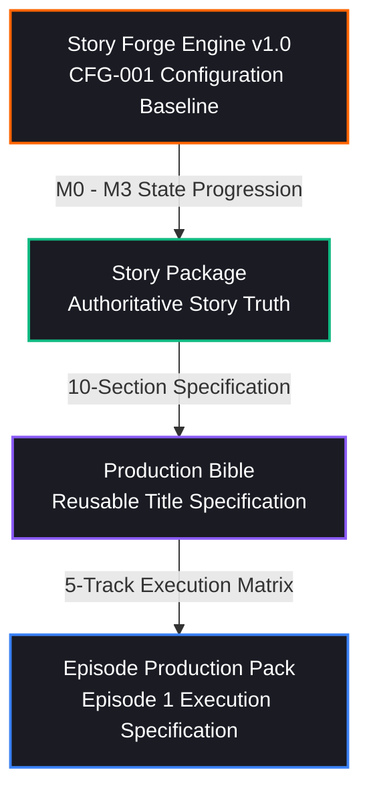

# Welele Production Architecture Specification: Story Package → Production Bible → Episode Production Pack

**Document Version:** 1.1.0 (Audited Governance & Provenance Tracing)  
**Title Asset:** *Isibusiso* (`IP-ISIBUSISO` / `ip_49913202`)  
**Forge Configuration Anchor:** `CFG-001`  
**Lineage Hash:** `f65ead9a0006d40f0647a2277eb2efc20443c174b32370ffdecd940199d892e6`  
**Governing Law:** *Canon must override prompt convenience. Production must never silently create new story canon.*

---

## 1. Hierarchy of Narrative Truth & Provenance Taxonomy

The Welele Production Architecture enforces a four-layer transformation pipeline where downstream execution specifications must trace every atomic element back to its authoritative source without introducing unapproved story lore or mutating established canon.



### Four Provenance Classifications
Every atomic element in the Production Bible and Episode Production Pack is assigned one of four audited provenance classes:

1. **`CANON`**: Direct, immutable story truth originating directly from the Story Package. Downstream generation prompts cannot alter, omit, or contradict this.
2. **`DERIVED`**: Formatted or synthesized logically from canonical story parameters without inventing new narrative facts (e.g. translating story location context into shooting stage spatial layouts).
3. **`GENERATED`**: Execution-level creative specifications generated for production prompts (e.g. shot camera lenses, lighting kelvin ratios, Foley events, score BPM and instrumentation).
4. **`PRODUCTION_DECISION`**: Explicit operational, technical, or budget constraints established by production policy (e.g., 9:16 vertical ratio, 90s episode duration cap, cast density per scene).

---

## 2. Canonical 10-Section Production Bible (*Isibusiso* Specimen)

The Production Bible is the **reusable, title-level production specification** derived from the Story Package. Below is the audited provenance mapping for all 10 sections.

| Section | Title | Provenance Class | Authoritative Source Path | Core Specification & Boundaries |
| :--- | :--- | :--- | :--- | :--- |
| **1** | **Title Identity** | `CANON` | `story_package.title_identity` | Title: *Isibusiso*, Franchise Code: `IP-ISIBUSISO`. Format: `9:16 Vertical Microdrama`. Target Duration: `90s`. Vernacular: `isiZulu`. |
| **2** | **Creative DNA** | `CANON` | `story_package.creative_dna` | Logline: High-stakes collision between Sandton dynastic mining wealth and sacred ancestral customary rights in Soweto. Theme: Commodification of sacred bloodlines. |
| **3** | **Character Production Bible** | `CANON` (Core) / `DERIVED` (Visual) / `PRODUCTION_DECISION` (Casting) | `story_package.characters[0..2]` | **Thandiwe Sithole** (Protagonist): Mid-50s devout midwife, weathered green tunic, rigid moral pride.<br/>**Bhekisisa Khumalo** (Antagonist): Late-50s mining oligarch, charcoal bespoke suit, dynastic panic.<br/>**Lerato Sithole** (Supporting): Mid-20s, postpartum exhaustion, loan shark debt guilt. |
| **4** | **World / Location Bible** | `DERIVED` | `story_package.locations` | **Mofolo South Clinic Ward**: 15m² practical interior, iron gurney, wooden cabinet, 2700K candle key.<br/>**Clinic Exterior Gate**: Corrugated iron perimeter, dawn dust, convoy headlight glare (5600K). |
| **5** | **Supernatural / World Rules** | `CANON` | `story_package.inviolable_rules` | 1. Customary Zulu royal covenants supersede modern commercial contracts.<br/>2. Khumalo platinum concessions void without direct male heir.<br/>3. 1912 Madadeni seal triggers statutory land freeze. |
| **6** | **Visual Language** | `PRODUCTION_DECISION` | `production_standards.visual_grammar` | 9:16 vertical composition, extreme close-up eye lines, chiaroscuro lighting (2700K candle key vs 5600K headlight rim), Dutch low-angle power framing. |
| **7** | **Audio Language** | `PRODUCTION_DECISION` | `production_standards.audio_mastering` | Multitrack separation: locked isiZulu dialogue at -14 LUFS, heavy low-end bass heartbeat (68 BPM), blackout Foley silence. |
| **8** | **Continuity Bible** | `CANON` | `story_package.chronology_and_plants` | 6-anchor chronology spine; plant tracking for infant birthmark (left shoulder blade) and 1912 customary seal document state. |
| **9** | **Production Constraints** | `PRODUCTION_DECISION` | `production_guidelines.constraints` | Maximum 3 speaking roles per scene. Maximum 2 distinct practical sets per episode. |
| **10** | **Prompt Constitution** | `CANON` | `creative_constitution.v1` | Inviolable prompt rule: `CANON_OVERRIDES_PROMPT_CONVENIENCE`. Downstream generators cannot invent new lore, modify character motivations, or alter cliffhanger questions. |

---

## 3. Coordinated 5-Track Episode Production Pack (*Isibusiso* Episode 1)

The Episode Production Pack is the **episode-specific execution specification** derived from the Production Bible and Episode Architecture.

```
Episode 1: "The Midnight Sovereign" (Specimen)
Duration: 88 seconds | Format: 9:16 Vertical
Paywall Cliffhanger: "Will Thandiwe sign the Khumalo settlement or trigger a township uprising to protect the royal infant?"
```

### 5-Track Execution Matrix & Provenance Tracing

```mermaid
gantt
    title Isibusiso Episode 1 - Coordinated 5-Track Timeline (88 Seconds)
    dateFormat X
    axisFormat %s s

    section Track 1: VIDEO (GENERATED)
    Scene 1 (Int. Clinic Ward - Birthmark Reveal) :0, 25
    Scene 2 (Int. Ward - Briefcase Offer)         :25, 50
    Scene 3 (Ext. Threshold - Sunrise Stand-off)   :50, 88

    section Track 2: DIALOGUE (CANON)
    Thandiwe: "A child is not platinum ore..."    :25, 45
    Bhekisisa: "That child keeps my shafts open"   :48, 65
    Lerato: "Mama, forgive me..."                 :68, 80

    section Track 3: NARRATION (DERIVED)
    Opening Hook: "In Soweto, blood is thicker..." :0, 15
    Inner Monologue Climax                        :75, 88

    section Track 4: AMBIENCE (GENERATED)
    Blackout room tone + Infant cry               :0, 25
    V8 Diesel rumble + Briefcase latch snap       :25, 55
    Sjambok snaps + 9mm Handgun racking            :55, 88

    section Track 5: MUSIC (GENERATED)
    68 BPM Zulu drum pulse                        :0, 30
    Staccato Cello Tension                        :30, 60
    Brass Crescendo -> Sudden Silence at Paywall   :60, 88
```

### Traceability Breakdown by Production Track

#### Track 1: VIDEO (`GENERATED`)
- **Source Path:** `generator.track_video` (synthesized from `story_package.beats` and `production_standards.visual_grammar`).
- **Scene Breakdown:**
  - `Scene 1 (00:00 - 00:15)`: *INT. MOFOLO CLINIC WARD - NIGHT*. Extreme close-up on infant left shoulder blade revealing royal ink-mark in 2700K candle glow.
  - `Scene 2 (00:15 - 00:50)`: *INT. CLINIC WARD - DAWN*. Low-angle vertical Dutch shot of Bhekisisa Khumalo; aluminum briefcase snapping open with cash stacks.
  - `Scene 3 (00:50 - 00:88)`: *EXT. CLINIC THRESHOLD - SUNRISE*. Whip-pan from guards racking 9mm handguns to community with sjamboks; Thandiwe raising customary ledger into golden sunrise.

#### Track 2: DIALOGUE (`CANON` Spoken Lines + `DERIVED` Subtext)
- **Source Path:** `story_package.dialogue` (verbatim lines anchored to character profiles).
- **Dialogue Lines:**
  - **00:35 - Thandiwe Sithole** (*Steely maternal authority*):  
    `"A child is not platinum ore to be dug up and traded in Sandton, Bhekisisa."`  
    *Subtext (DERIVED):* Moral defiance rejecting commodification of sacred bloodline.
  - **00:55 - Bhekisisa Khumalo** (*Cold corporate threat*):  
    `"That child carries the only bloodline that keeps my mining shafts open. Hand him over."`  
    *Subtext (DERIVED):* Dynastic survival panic masked behind aristocratic arrogance.
  - **00:72 - Lerato Sithole** (*Desperate pleading*):  
    `"Mama, forgive me... I had no other way to clear the loan sharks."`  
    *Subtext (DERIVED):* Guilt and plea for maternal sanctuary.

#### Track 3: NARRATION (`DERIVED`)
- **Source Path:** `story_package.thematic_premise` (voiceover hook derived from logline).
- **00:02 Hook:** `"In Soweto, blood is thicker than gold... but at dawn, gold came to collect."`
- **00:12 Inner Monologue:** `"(Silent prayer) Nkosi yam... not this bloodline. Not in my clinic."`

#### Track 4: AMBIENCE (`GENERATED`)
- **Source Path:** `generator.track_ambience` (sound design timeline synchronized to scene events).
- **00:00 - 00:25:** Rolling blackout room tone; faint distant township sounds; infant cry.
- **00:25 - 00:55:** V8 diesel engine rumble; metallic briefcase latch snap; cash rustle.
- **00:55 - 00:88:** Morning wind through corrugated iron fence; 9mm handgun slide racking; sjambok snaps.

#### Track 5: MUSIC (`GENERATED`)
- **Source Path:** `generator.track_music` (score cue sheet aligned to dramatic tension curve).
- **00:00 - 00:30:** 68 BPM Zulu drum heartbeat pulse.
- **00:30 - 00:65:** Staccato cello rhythm building tension as convoy arrives.
- **00:65 - 00:87:** String tremolo and brass crescendo reaching peak intensity.
- **00:88:** Abrupt cut to absolute silence at paywall freeze-frame.

---

## 4. Transformation Layer Governance Audit

| Evaluation Dimension | Manual Production Prompt Pack | Automated Welele Bible + Pack | Audit Finding |
| :--- | :--- | :--- | :--- |
| **Canon Preservation** | Curation dependent | Enforced via explicit `CANON` provenance tags | Preserves story invariants without mutation |
| **Provenance Tracking** | Informal notes | Explicit machine-readable `source_path` attributes | Traced to Story Package & CFG-001 |
| **Schema Completeness** | Narrative text blocks | Canonical 10-Section Schema | All 10 sections populated |
| **5-Track Coordination** | Script annotations | Synchronized timeline (Video, Dialogue, Narration, Ambience, Music) | Aligned to 88s episode structure |
| **Inviolability Rule** | Human diligence | Validated via `CANON_OVERRIDES_PROMPT_CONVENIENCE` | Prompt convenience cannot override story truth |

---

## 5. Summary

The transformation layer:
$$\text{Story Forge (M0–M3)} \longrightarrow \text{Story Package} \longrightarrow \text{Production Bible} \longrightarrow \text{Episode Production Pack}$$
provides a structured, machine-readable pipeline that preserves narrative truth, enforces provenance classification, and binds downstream generation prompts to upstream story canon.
