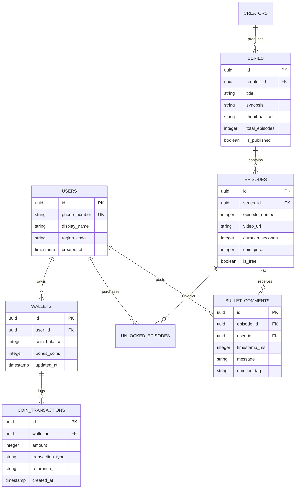

# Welele Media™ — System Architecture & Engineering Manifesto

**Version:** 1.0 (Architecture Freeze)  
**Status:** Locked & Canonical  
**Target Platform:** Mobile Web PWA / Ultra-Low-Latency Pan-African Stream  
**Core Thesis:** *“Technology enables the ecosystem. Content is the ecosystem.”*

---

## 1. Executive Summary & Core Manifesto

**Welele Media™** is a next-generation vertical micro-drama streaming platform engineered specifically for mobile-first, bandwidth-conscious, high-engagement audiences. 

The primary goal of Welele Media is not to showcase software complexity, but to catalyze a cultural phenomenon. Our metric of ultimate success is simple:
> **When audiences say *"Have you watched this Welele?"* rather than *"Have you seen this app?"***

Technical decisions are strictly evaluated by their ability to reduce friction, maximize viewing immersion, guarantee transactional integrity, and empower African and global storytellers.

---

## 1.1 The Creator Experience & UX Charter (The 4 Laws)

```
+-------------------------------------------------------------------------------+
|                       THE 4 CREATOR UX LAWS                                   |
+-------------------------------------------------------------------------------+
|  Law #1: Creators create. Welele operates the machine.                        |
|  Law #2: Never expose an architectural concept when a human concept will do.  |
|  Law #3: If Welele can do it for the creator, Welele should do it.            |
|  Law #4: Complexity may exist underneath the experience, but it must not      |
|          become cognitive load.                                               |
+-------------------------------------------------------------------------------+
```

### Creator UX Law #1: Creators create. Welele operates the machine.
The creator's mental model is simple: *"I have a show. I have an episode. I have a video. I want to publish it."* The platform abstracts ingestion, encoding, storage keys, rights lineage, and delivery behind intuitive human touchpoints.

### Creator UX Law #2: Never expose an architectural concept when a human concept will do.
Internal domain architecture (`SeriesRepository`, `DigitalIP`, `MediaAsset`, `PreflightHealthCheck`, `Ledger`) remains strictly intact in the backend, but surfaces human terminology to creators:
- `Series Command Rooms` $\rightarrow$ **My Shows / Show Workspace**
- `Episode Ingestion Pipeline` $\rightarrow$ **Add Episode**
- `Media Assets / Presigned Storage URLs` $\rightarrow$ **Video (Drag & Drop)**
- `Preflight & Safety Checks` $\rightarrow$ **Welele Quality Check**
- `Telemetry & Analytics DAL` $\rightarrow$ **Insights**

### Creator UX Law #3: If Welele can do it for the creator, Welele should do it.
Don't make creators perform manual math or technical steps (calculating runtimes in seconds, typing aspect ratios, generating thumbnails, or formatting storage keys). The browser and backend automatically inspect files, extract metadata, generate posters, and run quality checks.

### Creator UX Law #4: Complexity may exist underneath the experience, but it must not become cognitive load.
Welele is an institutional-grade Digital IP & Commerce Engine underneath, but presents a simple, clean, and elegant surface. The depth of the machine is our moat; the simplicity of the experience is our product.

---

## 2. The 8 Frozen Architectural Pillars

```
+-------------------------------------------------------------------------------+
|                        THE 8 WELELE PILLARS                                   |
+-------------------------------------------------------------------------------+
|  1. 9:16 Canonical Viewer       |  5. Unified Payment Abstraction            |
|  2. PWA First Architecture      |  6. Regional Monetisation Provider Pattern |
|  3. Relational Transaction Core |  7. Content as the Primary Asset           |
|  4. Object Storage + CDN Media  |  8. Community Embedded in the Stream       |
+-------------------------------------------------------------------------------+
```

### Pillar 1: 9:16 Canonical Format
- Strict **9:16 vertical aspect ratio** throughout all player viewports.
- Zero accommodations for legacy letterboxing or horizontal layouts.
- Full-bleed, edge-to-edge cinematic frame optimized for one-thumb vertical swipe navigation.

### Pillar 2: PWA First (Progressive Web App)
- Direct web deployment bypassing app store approval cycles, 30% store tax, and high APK download barriers.
- Service-worker powered offline metadata caching, fast app launch, and instant install-to-homescreen banners.
- Tailored for ultra-fast load times across budget and flagship smartphones alike.

### Pillar 3: Postgres / Supabase Transaction Core
- The transactional core (user wallets, coin balances, unlocks, ledgers, subscriptions, and creator royalty splits) strictly resides in **PostgreSQL**.
- Guarantees ACID compliance, preventing double-spend and ledger discrepancies.

### Pillar 4: Object Storage + CDN for Video
- **Rule:** The database never stores video binaries.
- Master video assets reside in high-durability Object Storage (S3 / Cloudflare R2 / Supabase Storage).
- Public delivery is routed through edge-cached CDNs with adaptive bitrate streaming (HLS/DASH) and fragmented MP4 delivery.

### Pillar 5: Unified Payment Abstraction
- All monetisation methods—Airtime (Direct Carrier Billing), Debit/Credit Cards, Wallets, Instant EFT, Voucher codes, and Coins—sit behind a unified internal `PaymentGateway` interface.
- Client applications interact exclusively with the virtual wallet and coin unlock mechanics, decoupling checkout mechanics from playback.

### Pillar 6: Regional Monetisation Provider Pattern
- Architecture avoids hardcoded regional payment logic.
- Implements a `RegionalMonetisationProvider` abstraction where **South Africa (ZAR, Airtime DCB, Ozow, 1Voucher)** serves as `ProviderInstance_001`, designed for zero-refactor rollout across Nigeria, Kenya, Ghana, and international markets.

### Pillar 7: Content is the Primary Asset
- The technology platform exists to serve the dramatic hook, the pacing, and the creator pipeline.
- Systems are optimized for **60–90 second episodic micro-dramas**, cliffhanger paywalls, and viral snippet distribution.

### Pillar 8: Community Embedded in the Viewing Experience
- Community is not a secondary tab—it is integral to the playback surface.
- Time-synced bullet comments ("flying comments"), live reaction sparks, and integrated Welele Chat turn solitary watching into shared cultural commentary.

---

## 3. High-Level System Architecture

```mermaid
graph TD
    subgraph Client Layer [PWA Frontend (React 18 + Vite + Tailwind/Vanilla CSS)]
        A[9:16 Fullscreen Player] --> B[Episode Swiper / Carousel]
        A --> C[Welele Chat & Flying Comments]
        A --> D[Coin Unlock / Paywall Gate]
        E[Service Worker & Asset Cache]
    end

    subgraph Edge & CDN Layer [Cloudflare Global Network]
        CDN_VOD[CDN Edge Video Cache]
        CDN_API[Edge Reverse Proxy & SSL]
    end

    subgraph Backend Services [FastAPI Application Cluster]
        API_AUTH[Auth & User Service]
        API_CONTENT[Series & Episode Metadata]
        API_WALLET[Wallet, Coins & Ledger Engine]
        API_CHAT[Real-time Bullet & Threaded Chat]
        API_AI[AI Scene Analytics & Script Assist]
    end

    subgraph Data & Storage Layer
        DB[(PostgreSQL / Supabase Relational Core)]
        CACHE[(Redis Stream & Active Session Cache)]
        S3[Object Storage / Cloudflare R2 / S3]
    end

    subgraph Regional Payment Providers
        PROV_SA[SA Monetisation Provider: Airtime / Ozow / Cards]
        PROV_PAN[Pan-African Provider Extensions]
    end

    Client Layer -->|HLS / Video Buffers| CDN_VOD
    CDN_VOD --> S3
    Client Layer -->|REST / WebSocket| CDN_API
    CDN_API --> Backend Services
    Backend Services --> DB
    Backend Services --> CACHE
    API_WALLET --> PROV_SA
    API_WALLET --> PROV_PAN
```

---

## 4. Frontend Architecture (Client Layer)

### 4.1 Component Structure
- **Root Layout (`src/App.tsx`)**: Controls global navigation, authentication state, and modal overlays.
- **9:16 Video Canvas (`src/components/viewer/`)**:
  - `VideoPlayer.tsx`: Native HTML5/HLS.js player instance with custom touch handlers.
  - `EpisodeDrawer.tsx`: Bottom sheet allowing rapid scrubbing across 30–80 episodes per series.
  - `WeleleChatOverlay.tsx`: Interactive, collapsible overlay rendering synchronized audience reactions without obscuring critical subtitle zones.
  - `PaywallModal.tsx`: Seamless single-tap episode unlock modal displaying coin balances and instant airtime top-up.
- **Discovery Engine (`src/components/viewer/DiscoverScreen.tsx`)**:
  - Algorithmic feed showcasing trending micro-dramas, creator spotlights, and genre filters (Romance, Revenge, Thriller, Township Drama).

### 4.2 Performance & Bandwidth Safeguards
- **Chunked Preloading**: Automatically buffers the first 3 seconds of the *next* episode in the playlist to deliver zero-latency auto-advancement.
- **Adaptive Bitrate Switching**: Automatic resolution degradation (1080p $\rightarrow$ 720p $\rightarrow$ 480p $\rightarrow$ 360p) based on client network throughput.
- **DOM Recycling**: Offscreen video elements are destroyed to maintain 60 FPS performance on memory-constrained mobile browsers.

---

## 5. Backend Architecture & Domain Services

Built with **FastAPI (Python 3.11+)** and **PostgreSQL (Supabase)** for high-throughput asynchronous execution.

### 5.1 Domain Services

```
backend/
├── app/
│   ├── main.py                     # Entry point & lifespan management
│   ├── routers/
│   │   ├── auth.py                 # Phone OTP, Google, Anonymous Guest Auth
│   │   ├── series.py               # Series catalog, tags, and creator profiles
│   │   ├── episodes.py             # Episode stream links & watch state
│   │   ├── wallet.py               # Coins balance, purchase packs, unlocks
│   │   ├── payments.py             # Webhooks & regional provider dispatcher
│   │   ├── chat.py                 # Realtime timecoded comments & reactions
│   │   ├── ai.py                   # Hook detection, subtitle generation
│   │   └── admin.py                # Operations portal & analytics
│   ├── services/
│   │   ├── payment_service.py      # Abstract payment orchestrator
│   │   ├── regional_provider.py    # Region-specific adapter resolution
│   │   ├── ledger_service.py       # Immutable double-entry coin transactions
│   │   └── video_service.py        # Signed CDN URL generator & transcode hooks
│   └── models/                     # SQLAlchemy / Pydantic schemas
```

---

## 6. Database & Ledger Schema (PostgreSQL Core)



---

## 7. Monetisation & Regional Abstraction Architecture

### 7.1 Provider Interface Specification

```python
# Conceptual Architecture Pattern
class BaseMonetisationProvider(ABC):
    @abstractmethod
    async def initiate_topup(self, user_id: str, pack_id: str, phone: str) -> TopupResponse:
        """Initiates billing flow via region-specific channel (Airtime, Card, EFT)."""
        pass

    @abstractmethod
    async def verify_webhook(self, payload: dict, headers: dict) -> WebhookResult:
        """Validates cryptographic webhook signature and extracts transaction status."""
        pass

    @abstractmethod
    async def query_transaction(self, external_ref: str) -> TransactionStatus:
        """Fallback polling for asynchronous payment settlement."""
        pass
```

### 7.2 South Africa Implementation (`ZA_MonetisationProvider`)
- **Direct Carrier Billing (Airtime)**: 1-Click purchase deducted directly from Vodacom, MTN, Telkom, or Cell C airtime balances.
- **Voucher Integration**: 1Voucher / OTT Voucher PIN redemption directly converted to Welele Coins.
- **Card & Instant EFT**: Ozow, Paystack, and Stitch integration for banking customers.

---

## 8. Video Pipeline & Delivery Standard

```
[Raw 9:16 4K/1080p Master] 
       │
       ▼
[Transcoding Cluster] (FFmpeg / AWS MediaConvert)
       ├── 1080x1920 (High Bandwidth / Wi-Fi)
       ├── 720x1280 (Standard 4G Mobile)
       ├── 480x854 (Data-Saver / 3G Mobile)
       └── 360x640 (Ultra Data-Saver)
       │
       ▼
[HLS Segment Packaging (.m3u8 + .ts/.m4s)]
       │
       ▼
[Origin Storage (Cloudflare R2 / S3)] 
       │
       ▼
[Global Edge CDN (Cloudflare Video Caching)]
       │
       ▼
[Welele Mobile PWA Player (Chunked Adaptive Stream)]
```

---

## 9. Content Engine & Creator Flywheel

The technical architecture directly powers the 3-step **Binge & Monetise Loop**:

```
Episode 1 - 3: FREE HOOK 
   ↳ Instant zero-barrier streaming. Hook the user in 180 seconds.
Episode 4 - 5: SOFT GATE 
   ↳ Unlocked via simple 1-tap Free Daily Reward or Account Sign-in.
Episode 6+: HARD PAYWALL / COIN UNLOCK 
   ↳ 10–20 Coins per episode, or Airtime 1-Tap purchase.
Final Episode: CLIFFHANGER CLIMAX
   ↳ Prompts next series recommendation or premium season pass.
```

### Creator Analytics & Optimization Engine
- **Retention Curve Telemetry**: Track drop-offs at exact timestamps ($t = 3s$, $t = 15s$, $t = 45s$) to advise creators on cliffhanger effectiveness.
- **Automated Royalty Engine**: Revenue shares from episode coin unlocks are credited directly to verified creator balances with automated payout generation.

---

## 10. Security, Governance & Scalability

1. **DRM & Stream Protection**: Signed URLs with short expiration windows (TTL 60s) preventing hotlinking and unauthorized asset scraping.
2. **Double-Entry Balance Auditing**: Coin transactions are strictly additive in the audit log; current balance is verified with strict database row-level locking (`SELECT ... FOR UPDATE`).
3. **Idempotent Webhooks**: All payment webhooks require idempotent processing keys to prevent duplicate coin allocations from carrier retry bursts.
4. **Content Moderation & Rating**: Metadata tags for parental guidance, localized language labeling (isiZulu, isiXhosa, Sesotho, Afrikaans, English), and age restrictions.

---

## 11. Document History

| Date | Version | Description | Author / Sign-off |
|---|---|---|---|
| **2026-09-07** | **1.0** | **Architecture Frozen around 8 Core Pillars** | **Welele Engineering & Leadership** |
